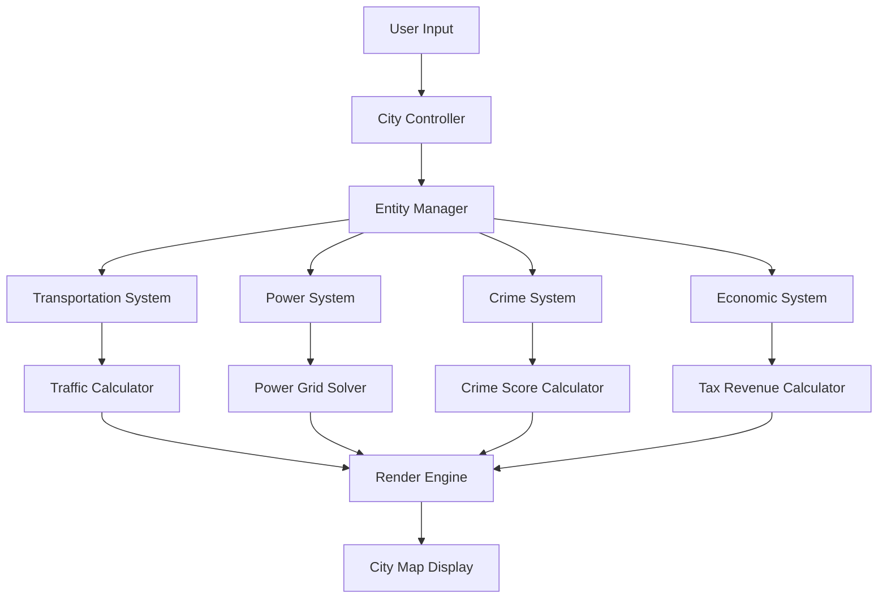

# City Simulator Design Document

## Overview

The City Simulator employs a modular, event-driven architecture built around an Entity-Component-System (ECS) pattern to efficiently manage thousands of interconnected urban elements. The system is designed for real-time simulation with cascading effects between transportation, utilities, economics, and social systems while maintaining performance and extensibility.

## Architecture

### Core Architecture Pattern

The system uses a **hybrid ECS-MVC architecture**:
- **Entities**: Buildings, roads, power lines, zones, vehicles
- **Components**: Position, PowerConsumer, TrafficGenerator, CrimeInfluencer, TaxGenerator
- **Systems**: TransportationSystem, PowerSystem, CrimeSystem, EconomicSystem
- **Controllers**: Handle user input and coordinate between systems
- **Views**: Render the city map and provide UI for city management

### System Interaction Flow



### Data Flow Architecture

1. **Input Layer**: User interactions (placing buildings, zoning land)
2. **Controller Layer**: Validates inputs and coordinates system updates
3. **Simulation Layer**: Core systems process entity updates
4. **Calculation Layer**: Specialized calculators handle complex algorithms
5. **Presentation Layer**: Renders visual feedback and UI updates

## Components and Interfaces

### Core Entities and Components

```typescript
interface Entity {
  id: string;
  position: GridPosition;
  components: Component[];
}

interface GridPosition {
  x: number;
  y: number;
  width: number;
  height: number;
}

// Component interfaces
interface PowerConsumer {
  powerRequired: number;
  isPowered: boolean;
  priority: number;
}

interface TrafficGenerator {
  dailyTrips: number;
  peakHourMultiplier: number;
  destinations: string[];
}

interface TaxGenerator {
  annualRevenue: number;
  taxRate: number;
  landValue: number;
}
```

### System Interfaces

```typescript
interface SimulationSystem {
  update(deltaTime: number, entities: Entity[]): void;
  handleEntityAdded(entity: Entity): void;
  handleEntityRemoved(entity: Entity): void;
}

interface TransportationSystem extends SimulationSystem {
  calculateTrafficFlow(): TrafficFlowMap;
  findOptimalRoute(start: GridPosition, end: GridPosition): Route;
  updatePublicTransitUsage(): void;
}

interface PowerSystem extends SimulationSystem {
  solvePowerGrid(): PowerGridState;
  calculatePowerDemand(): number;
  identifyUnpoweredZones(): GridPosition[];
}
```

### Spatial Indexing

```typescript
interface SpatialGrid {
  cellSize: number;
  addEntity(entity: Entity): void;
  removeEntity(entity: Entity): void;
  getEntitiesInRadius(center: GridPosition, radius: number): Entity[];
  getEntitiesInCell(x: number, y: number): Entity[];
}
```

## Data Models

### City State Model

```typescript
interface CityState {
  entities: Map<string, Entity>;
  zones: ZoneMap;
  infrastructure: InfrastructureNetwork;
  economy: EconomicState;
  simulation: SimulationState;
}

interface ZoneMap {
  grid: ZoneType[][];
  landValues: number[][];
  updateLandValue(position: GridPosition, value: number): void;
}

interface InfrastructureNetwork {
  roads: RoadNetwork;
  powerGrid: PowerGrid;
  publicTransit: PublicTransitNetwork;
}
```

### Transportation Models

```typescript
interface RoadNetwork {
  nodes: Map<string, RoadNode>;
  edges: Map<string, RoadEdge>;
  trafficFlow: Map<string, number>;
  
  findPath(start: string, end: string): string[];
  calculateCapacity(edgeId: string): number;
}

interface PublicTransitNetwork {
  lines: TransitLine[];
  stations: TransitStation[];
  ridership: Map<string, number>;
}
```

### Economic Models

```typescript
interface EconomicState {
  municipalBudget: number;
  annualRevenue: number;
  annualExpenses: number;
  taxRates: TaxRates;
  
  calculateAnnualBudget(): BudgetReport;
  canAfford(cost: number): boolean;
}

interface BudgetReport {
  totalRevenue: number;
  revenueBySource: Map<string, number>;
  totalExpenses: number;
  expensesByCategory: Map<string, number>;
  netIncome: number;
}
```

## Error Handling

### System Resilience

1. **Graceful Degradation**: If one system fails, others continue operating
2. **State Validation**: Regular validation of entity states and relationships
3. **Recovery Mechanisms**: Automatic correction of invalid states
4. **Performance Monitoring**: Detection and handling of performance bottlenecks

### Error Categories

```typescript
enum SimulationError {
  INVALID_PLACEMENT = "INVALID_PLACEMENT",
  INSUFFICIENT_FUNDS = "INSUFFICIENT_FUNDS",
  POWER_GRID_OVERLOAD = "POWER_GRID_OVERLOAD",
  TRAFFIC_CONGESTION = "TRAFFIC_CONGESTION",
  SYSTEM_CALCULATION_ERROR = "SYSTEM_CALCULATION_ERROR"
}

interface ErrorHandler {
  handleError(error: SimulationError, context: any): void;
  recoverFromError(error: SimulationError): boolean;
}
```

### Validation Rules

- **Placement Validation**: Ensure buildings are placed in appropriate zones
- **Connection Validation**: Verify infrastructure connections are valid
- **Resource Validation**: Check sufficient resources before allowing actions
- **State Consistency**: Maintain consistency between related systems

## Testing Strategy

### Unit Testing Focus Areas

1. **Core Algorithms**: Traffic routing, power grid solving, crime calculation
2. **Entity Management**: Component addition/removal, entity lifecycle
3. **System Integration**: Inter-system communication and data flow
4. **Performance**: Stress testing with large numbers of entities

### Integration Testing

1. **System Interactions**: Verify cascading effects between systems work correctly
2. **User Workflows**: Test complete user scenarios from input to visual feedback
3. **Data Persistence**: Ensure city state can be saved and loaded correctly
4. **Performance Benchmarks**: Validate performance under realistic city sizes

### Testing Architecture

```typescript
interface TestScenario {
  name: string;
  setup(): CityState;
  execute(city: CityState): void;
  validate(city: CityState): boolean;
}

interface PerformanceTest {
  entityCount: number;
  expectedFrameRate: number;
  maxMemoryUsage: number;
}
```

### Simulation Validation

- **Traffic Flow Accuracy**: Verify traffic calculations match expected patterns
- **Power Grid Stability**: Ensure power distribution algorithms work correctly
- **Economic Balance**: Validate tax and expense calculations
- **Crime System Logic**: Test crime score calculations and police effectiveness

## Performance Considerations

### Optimization Strategies

1. **Spatial Partitioning**: Grid-based indexing for fast proximity queries
2. **Update Batching**: Process similar entities together for cache efficiency
3. **Lazy Evaluation**: Calculate expensive operations only when needed
4. **Memory Pooling**: Reuse objects to reduce garbage collection
5. **Level of Detail**: Reduce simulation fidelity for distant or less important areas

### Scalability Targets

- **City Size**: Support cities up to 100x100 grid cells
- **Entity Count**: Handle 10,000+ buildings and infrastructure elements
- **Frame Rate**: Maintain 30+ FPS during active simulation
- **Memory Usage**: Stay under 512MB for typical city sizes

### Critical Performance Paths

- **Traffic Calculation**: Optimize pathfinding and flow calculations
- **Power Grid Solving**: Efficient algorithms for power distribution
- **Rendering**: Minimize draw calls and use efficient rendering techniques
- **Spatial Queries**: Fast proximity searches for crime and land value calculations